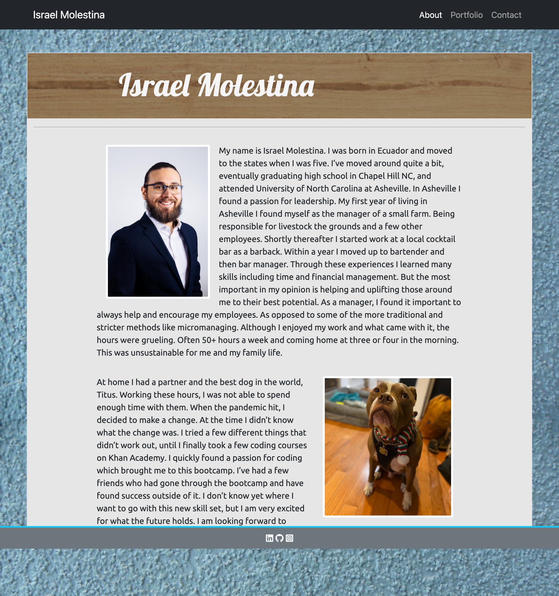
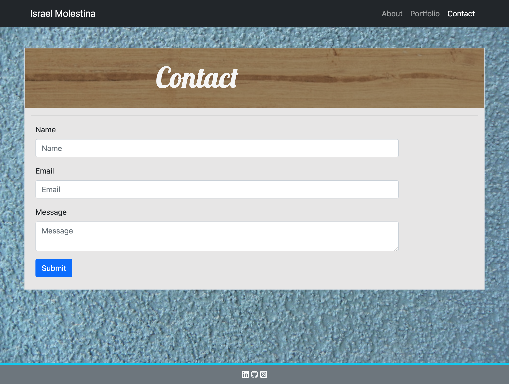

# Responsive Portfolio

## The Application
I've created a mobile responsive portfolio website to showcase my projects and accomplishments. I used Bootstrap CSS Framework to create this responsive layout, along with my own CSS file for some of the finishing touches. 

### Within the application you will find
* A responsive layout
* Responsive images
* A consistent navbar across each page
* Working links within the navbar to the About, Contact and Portfolio pages
* My personal bio, headshot, social media and projects
* A sticky header and footer

### Within the source code you will find
* Proper use of Bootstraps gid system
* Semantic and valid HTML
* No use of media queries as Bootstrap has minimized their need

## Below is the link to the finished application along with a screenshot of each page
### [Portfolio](https://israel-molestina.github.io/)
The screengrab extension I am using for chrome for some reason does not render the footer correctly which is why in the screenshot it appears to be floating. On the actual application the footer sticks to the bottom

## About Page

## Portfolio Page

## Contact Page

